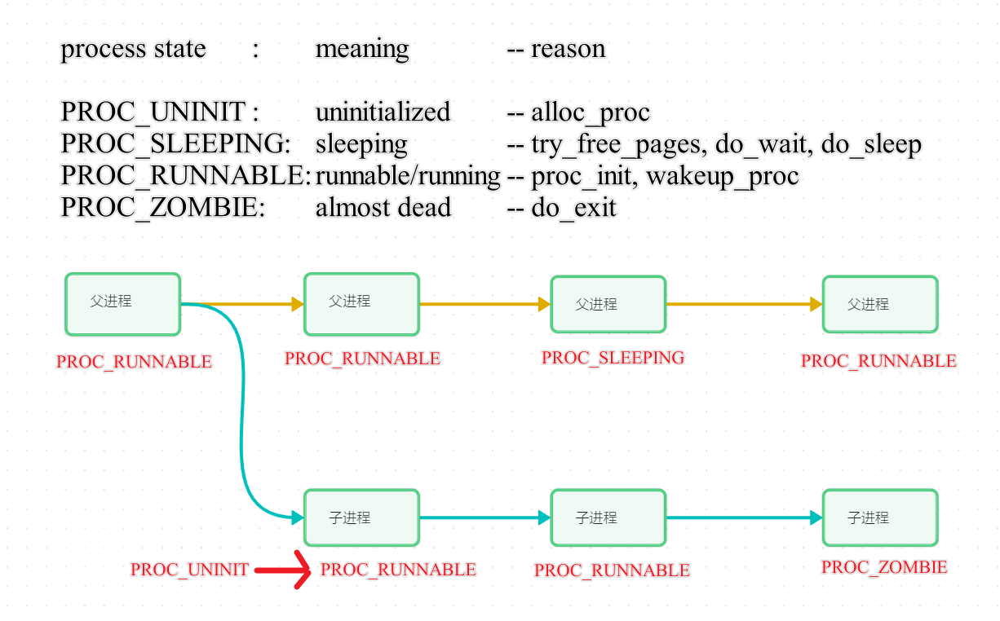
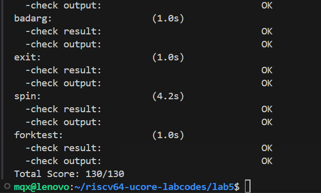

# lab4 进程管理

小组成员：王梓丞、王昱、孟启轩

## 实验目的

- 了解第一个用户进程创建过程
- 了解系统调用框架的实现机制
- 了解ucore如何实现系统调用sys_fork/sys_exec/sys_exit/sys_wait来进行进程管理

### 练习0：填写已有实验

本实验依赖实验2/3/4。请把你做的实验2/3/4的代码填入本实验中代码中有“LAB2”/“LAB3”/“LAB4”的注释相应部分。注意：为了能够正确执行lab5的测试应用程序，可能需对已完成的实验2/3/4的代码进行进一步改进。

在代码中对应的位置填入lab2-4的代码，值得注意的是，lab4中仅有两个内核进程需要进行创建和管理，对进程结构`proc_struct`的描述比较简单，而本实验涉及对用户进程的创建、管理等一系列操作，因此对该进程结构体中的成员变量进行了完善，因此需要对lab4中的代码进行部分更新，主要体现在两个方面：

#### 1.  进程分配函数`alloc_proc`

`proc_struct`中扩展了如下部分：

```cpp
int exit_code;                              // exit code (be sent to parent proc)
uint32_t wait_state;                        // waiting state
struct proc_struct *cptr, *yptr, *optr;     // relations between processes
```
其中wait_state 的作用表示当前进程的等待状态，用于协调调度器在不同条件下对进程的处理。cptr, yptr, optr 的用于维护父进程与子进程之间的关系，以及子进程之间的链表结构。这些字段形成了一个双向链表，具体关系如下：
cptr：指向父进程的第一个子进程。
yptr：指向当前进程在兄弟链表中的上一个兄弟。
optr：指向当前进程在兄弟链表中的下一个兄弟。
```cpp
proc->wait_state=0;
proc->cptr=NULL;
proc->yptr=NULL;
proc->optr=NULL;
```
在分配的初始化过程中，将等待状态`wait_state`设为0,意为为处于等待状态，同时将子进程指针和兄弟进程指针均设为空指针。

#### 2.  进程创建函数`do_fork`

同样，由于用户态进程的引入，需要新增对父进程状态以及进程间关系维护的代码，具体改动如下：

```cpp
current->wait_state = 0;
proc->parent = current;

...
set_links(proc);
```
首先需要将当前进程（也就是父进程）的等待状态设为0，确保其处于可调度状态，同时将新创建进程的父进程设为当前进程。在正确设置内核栈、共享内存、上下文及中断信息等后（省略号部分），需要将新进程插入到进程链表和哈希链表中，此处与lab4相比，还需要通过`set_links`额外设置新进程与其它进程的各类关系。


### 练习1：加载应用程序并执行（需要编码）

do_execv函数调用load_icode（位于kern/process/proc.c中）来加载并解析一个处于内存中的ELF执行文件格式的应用程序。你需要补充load_icode的第6步，建立相应的用户内存空间来放置应用程序的代码段、数据段等，且要设置好proc_struct结构中的成员变量trapframe中的内容，确保在执行此进程后，能够从应用程序设定的起始执行地址开始执行。需设置正确的trapframe内容。

请在实验报告中简要说明你的设计实现过程。

- 请简要描述这个用户态进程被ucore选择占用CPU执行（RUNNING态）到具体执行应用程序第一条指令的整个经过。

#### 问题1：

为了让用户级进程从内核返回到用户模式，执行以下操作：
- 将 `tf->gpr.sp` 设置为用户栈的顶部（即 `sp` 的值）。
- 将 `tf->status` 设置为适用于用户程序的值（即 `sstatus`），并清除 `SPP` 和 `SPIE` 标志，确保返回用户模式时的中断和特权级正确。
- 将 `tf->epc` 设置为用户程序的入口点（即 `sepc`）。

代码实现如下：
```c
tf->gpr.sp = USTACKTOP;          // 设置栈指针为用户栈的顶部
tf->status = sstatus & (~(SSTATUS_SPP | SSTATUS_SPIE));  // 配置状态寄存器
tf->epc = elf->e_entry;          // 设置程序计数器为程序入口点
```

#### 问题2：

这一过程实际上是由 `do_execve` 函数完成的。具体步骤如下：

1. 调度器通过 `schedule` 函数将CPU分配给用户态进程，进程调用 `exec` 系统调用，进入系统调用处理流程。
2. 控制权转移到 `syscall.c` 中的 `syscall` 函数，系统调用号指向 `sys_exec`，然后调用 `do_execve` 完成应用程序加载。
3. 在 `do_execve` 中，首先获取当前进程的内存管理结构，并切换到内核页表。
4. 调用 `load_icode` 函数为用户进程设置执行环境，具体过程包括：
   - 使用 `mm_create` 函数为进程分配内存管理数据结构，并初始化。
   - 使用 `setup_pgdir` 函数创建页目录表，将内核页表拷贝到新表中，并设置进程的页目录。
   - 解析 ELF 格式的程序，调用 `mm_map` 函数根据程序段的起始位置和大小创建 `vma` 结构，并将其插入到内存管理结构中。
   - 分配物理内存并建立虚拟地址到物理地址的映射，拷贝程序段数据到内存中。
   - 使用 `mm_mmap` 为用户进程设置栈空间，栈大小为 256 页（1MB），并创建虚拟到物理的映射关系。
5. 设置 `mm->pgdir` 为新的页目录，并更新 `cr3` 寄存器，完成虚拟内存空间的配置。
6. 清空并重新设置进程的中断帧，确保在执行中断返回指令（`iret`）后切换到用户态，并跳转到应用程序的第一条指令执行。此时，用户进程已准备好执行，并可以响应中断。

### 练习2：父进程复制自己的内存空间给子进程（需要编码）

创建子进程的函数do_fork在执行中将拷贝当前进程（即父进程）的用户内存地址空间中的合法内容到新进程中（子进程），完成内存资源的复制。具体是通过copy_range函数（位于kern/mm/pmm.c中）实现的，请补充copy_range的实现，确保能够正确执行。

请在实验报告中简要说明你的设计实现过程。

- 如何设计实现Copy on Write机制？给出概要设计，鼓励给出详细设计。

#### 问题1：

**copy_range函数的调用过程：do_fork()---->copy_mm()---->dup_mmap()---->copy_range()。**

`do_fork` 函数用于创建子进程，在执行过程中它会将父进程的用户内存地址空间中的有效内容复制到新进程（子进程）中。内存资源的复制通过 `copy_range` 函数实现，该函数位于 `kern/mm/pmm.c` 中。

`do_fork` 调用 `copy_mm` 来复制进程的内存管理结构（`mm`），而 `copy_mm` 则根据 `clone_flags & CLONE_VM` 的取值，决定是否调用 `dup_mmap`。`dup_mmap` 函数负责复制两个进程之间的内存映射关系。该函数的两个参数分别是目标进程和源进程的内存管理结构 `mm`。它通过循环，逐个复制内存映射区域（`vma`），并将每个 `vma` 插入到目标进程的 `mm` 中。然后调用 `copy_range` 将源进程的内存内容复制到目标进程中。

`copy_range` 函数的实现如下：
```c
int copy_range(pde_t *to, pde_t *from, uintptr_t start, uintptr_t end, bool share) {
    assert(start % PGSIZE == 0 && end % PGSIZE == 0);
    assert(USER_ACCESS(start, end));
    
    // 以页为单位复制内容
    do {
        // 获取源进程的页表项
        pte_t *ptep = get_pte(from, start, 0), *nptep;
        if (ptep == NULL) {
            start = ROUNDDOWN(start + PTSIZE, PTSIZE);
            continue;
        }
        
        // 获取目标进程的页表项。如果不存在，则分配一个新的页表
        if (*ptep & PTE_V) {
            if ((nptep = get_pte(to, start, 1)) == NULL) {
                // 分配新的页表
            }
            
            // 为目标进程分配一个新的物理页面
            pte_t *nptep = get_pte(to, start, 1);
            if (nptep == NULL) {
                nptep = alloc_page();
            }
            
            // 复制源进程页面到目标进程页面
            memcpy(page2kva(ptep), page2kva(nptep), PGSIZE);

            // 将目标进程页面与新的物理地址建立映射
            page_insert(nptep, pte2pa(nptep), start);
        }
        
        // 更新 start 到下一页
        start += PGSIZE;
    } while (start < end);
    
    return 0;
}
```

该函数的工作流程是：
1. 通过断言确保 `start` 和 `end` 地址是页面对齐并且属于用户地址空间。
2. 在循环中，函数按页处理内存内容。每次迭代，调用 `get_pte` 查找源进程的页表项，如果没有找到，跳过当前页并继续处理下一页。如果找到，则继续查找目标进程的页表项。如果目标进程的页表项不存在，则为其分配一个新的页表。
3. 为目标进程分配新的物理页面，并通过 `memcpy` 将源进程的物理页面内容复制到目标进程的物理页面。
4. 使用 `page_insert` 将新的物理页面与目标进程的虚拟地址建立映射。

这样，`copy_range` 函数实现了从源进程到目标进程的内存区域复制，确保子进程获得父进程的内存映射和内容。

#### 问题2：

**Copy on Write (COW)** 是一种延迟复制的技术，通常用于多个进程共享内存时，只有在某个进程试图修改内存内容时才会进行复制操作，从而保证数据的独立性。该机制需要有效地管理进程间的内存共享、修改时的复制以及数据一致性。设计时需要考虑以下两点：

1. **未修改时，如何实现内存共享？**
2. **修改时，如何进行资源复制和确保数据一致性？**

##### 内存共享

- **页表管理**：使用页表来追踪进程间共享的内存页，记录每个页的引用计数。
- **共享内存映射**：当一个进程创建时，内核分配一块共享内存，并将这块内存映射到多个进程的地址空间。
- **引用计数**：每个内存页都有一个引用计数，表示该页当前被多少进程使用。当进程共享一个页时，引用计数会增加。

##### 写时复制机制

- **页故障触发**：当进程尝试写入一个共享页时，内核会发生页故障。此时：
  - 如果该页的引用计数为1（即只有当前进程在使用），则直接允许写入。
  - 如果引用计数大于1，表示该页被多个进程共享，内核会执行复制操作。
- **复制操作**：
  - 分配一个新的物理页面。
  - 将源页的内容复制到新页。
  - 更新进程的页表，将其映射到新分配的页面。
  - 更新引用计数，确保新页面的独立性。

##### 引用计数和内存释放

- **引用计数管理**：每当一个新进程共享某个内存页时，引用计数增加；当进程结束时，引用计数减少。
- **释放内存**：当某个页的引用计数为0时，表示没有进程再使用该页，内核会释放该页的物理内存。

##### 数据一致性

- 在写时复制过程中，修改后的页面仅会影响修改它的进程，确保不同进程的内存独立性。
- 保持进程的页表和引用计数的正确性，以确保数据一致性。
- 确保每个进程能够正确访问其独立的内存数据。

##### 同步机制

- 为了避免多个进程同时修改同一共享页，必须使用同步机制来保证数据一致性。这可以通过锁或其他同步手段来确保在进行写时复制时，数据的正确性和一致性。

##### 详细设计

1. **初始化进程的共享内存**
   - 在进程创建时，内核为共享内存分配一块空间，并映射到多个进程的虚拟地址空间。共享内存的页表项会被设置为只读，以便在写操作发生时触发页故障。

2. **处理页故障（写时复制）**
   - 当一个进程试图修改共享的内存页时，触发页故障：
     1. 内核检查该页的引用计数。
     2. 如果引用计数为1，直接允许修改。
     3. 如果引用计数大于1，内核分配一个新的页面，复制源页的内容到新页面，并更新页表，使该进程指向新页。
     4. 更新该页的引用计数，确保共享内存的独立性。

3. **内存分配与页面复制**
   - `copy_range` 函数在写时复制时发挥作用。它分配新的页面并复制源页的内容到新页面。具体步骤：
     1. 获取源页和目标页的物理地址。
     2. 将源页内容复制到目标页。
     3. 更新页表，确保目标进程指向新的物理页面。

4. **释放内存**
   - 在引用计数为0时，内核会释放该物理页面。当某个页面的引用计数减少为0时，该页面会被回收，释放内存空间。

##### 代码示例
```c
void copy_page(pte_t *ptep, pte_t *nptep, uintptr_t start) {
    // 获取源页的物理页面
    struct Page *page = pte2page(*ptep);
    // 为目标进程分配新页面
    struct Page *npage = alloc_page();
    assert(page != NULL && npage != NULL);
    
    // 将源页内容复制到目标页
    void *src_kvaddr = page2kva(page);
    void *dst_kvaddr = page2kva(npage);
    memcpy(dst_kvaddr, src_kvaddr, PGSIZE);
    
    // 将新页面插入页表
    int ret = page_insert(nptep, npage, start, PTE_USER);
    assert(ret == 0);
}
```

### 练习3: 阅读分析源代码，理解进程执行 fork/exec/wait/exit 的实现，以及系统调用的实现
请简要说明你对 fork/exec/wait/exit函数的分析。并回答如下问题：

- 请分析fork/exec/wait/exit的执行流程。重点关注哪些操作是在用户态完成，哪些是在内核态完成？内核态与用户态程序是如何交错执行的？内核态执行结果是如何返回给用户程序的？
- 请给出ucore中一个用户态进程的执行状态生命周期图（包执行状态，执行状态之间的变换关系，以及产生变换的事件或函数调用）。（字符方式画即可）

执行：make grade。如果所显示的应用程序检测都输出ok，则基本正确。（使用的是qemu-1.0.1）

#### 问题1：分析fork/exec/wait/exit的执行流程

##### 1.fork()函数的执行流程如下：
在执行完 fork() 函数后，如果成功创建了新进程，将会形成两个进程：一个是父进程，另一个是子进程。在子进程中，fork() 函数的返回值为 0，而在父进程中，它则返回新创建子进程的进程ID。通过这个返回值，程序可以判断当前执行的是哪个进程，从而区分是子进程还是父进程。
```c
// 调用过程：fork->SYS_fork->do_fork + wakeup_proc
// wakeup_proc 函数主要是在当前进程上下文中创建一个新的子进程或内核线程，并将进程的状态设置为“就绪”。
do_fork()
1、初始化进程指针(struct proc_struct *proc); 
2、检查当前系统中的进程数量是否已达上限;
3、分配并初始化进程控制块(alloc_proc 函数);
4、将新进程的 parent 指针指向当前进程 (current)
5、分配并初始化内核栈(setup_stack 函数);
6、根据 clone_flag标志复制或共享进程内存管理结构(copy_mm 函数);
7、设置进程在内核(将来也包括用户态)正常运行和调度所需的中断帧和执行上下文(copy_thread 函数);
8、把设置好的进程控制块放入hash_list 和 proc_list 两个全局进程链表中;
9、唤醒新进程,把进程状态设置为“就绪”态;
10、设置返回值为新进程的 PID;
11、清理内核栈和进程结构体;
```
- 用户态程序调用sys_fork()系统调用，通过syscall进入内核态。
- 内核态处理sys_fork()系统调用，调用do_fork()函数创建子进程，完成后返回到用户态。

##### 2.exec()函数的执行流程如下：
完成用户进程的创建工作。首先需要对用户态的内存空间进行清空，以便为加载新的执行代码做好准备。接下来，系统将应用程序的执行代码加载到当前进程新创建的用户态虚拟空间中。这样，进程就可以顺利执行所需的应用程序。
```c
// 调用过程： SYS_exec->do_execve
1、首先，为加载新的执行代码做好用户态内存空间的清空准备。如果 mm 不为 NULL，则将页表设置为内核空间页表，并进一步检查 mm 的引用计数。如果引用计数减一后为零，说明没有进程再需要该内存空间，这时应根据 mm 中的记录释放该进程占用的用户空间内存及其进程页表本身所占的空间。最后，将当前进程的 mm 内存管理指针置为空;
2、接下来，将应用程序的执行代码加载到当前进程新创建的用户态虚拟空间中。完成后，调用 load_icode 函数以准备好执行该代码。
```
- 用户态程序调用sys_execve()系统调用，通过syscall进入内核态。
- 内核态在处理 sys_exec() 系统调用时，会调用 do_execve() 函数来加载新的程序。但是，由于当前处于 S mode，无法直接进行上下文切换。因此，系统使用 ebreak 指令产生断点中断，将控制权转发到 syscall() 函数，在该函数中完成上下文切换，并最终返回到用户态。

##### 3.wait()函数的执行流程如下：
父进程通过调用 wait() 函数来等待子进程的结束。而 wait_pid 函数则用于等待特定进程 ID 为 pid 的子进程的结束通知。这两个函数最终都会调用 sys_wait 系统调用接口，以便让 ucore 完成对子进程的最终回收工作。
```c
// 调用过程：SYS_wait->do_wait
1、当 pid != 0 时，表示只查找一个特定的子进程，其进程 ID 为 pid，否则查找任意一个处于退出状态的子进程;
2、如果该子进程的执行状态不是 PROC_ZOMBIE，则表示此子进程尚未退出。在这种情况下，当前进程会将自己的执行状态设置为 PROC_SLEEPING（睡眠），原因是等待子进程退出（WT_CHILD）。然后，调用 schedule() 函数来选择新的进程执行，而当前进程将进入睡眠状态。如果当前进程被唤醒，将返回并重新执行步骤 1;
3、如果该子进程的执行状态为 PROC_ZOMBIE，则说明子进程处于退出状态，这时需要父进程完成对子进程的最终回收工作。具体操作包括将子进程的控制块从两个进程队列 proc_list 和 hash_list 中删除，并释放其内核堆栈和进程控制块。至此，子进程的执行过程彻底结束，所占用的所有资源均已释放。
```
- 用户态程序通过调用 sys_wait() 系统调用，进入内核态。
- 内核态在处理 sys_wait() 系统调用时，会调用 do_wait() 函数来等待子进程结束，完成后返回到用户态。

##### 4.exit()函数的执行流程如下：
进程调用 exit() 函数，终止进程的执行。
```c
// 调用过程：SYS_exit->exit
1、首先判断当前进程是否为用户进程。如果是用户进程，则开始回收其所占用的用户态虚拟内存空间（具体回收过程不再详细说明）;
2、将当前进程的执行状态设置为 PROC_ZOMBIE，并将退出码设置为 error_code，这表明该进程已无法调度，只能等待父进程来完成最后的资源回收工作（主要是释放子进程的内核栈和进程控制块）;
3、如果当前父进程正在等待子进程的状态，即其 wait_state 被设置为 WT_CHILD，则可以唤醒父进程，让其完成对子进程的最后资源回收工作;
4、如果当前进程还有子进程，需要将这些子进程的父进程指针设置为内核线程 init，并将各个子进程插入到 init 的子进程链表中。如果某个子进程的执行状态为 PROC_ZOMBIE，则需要唤醒 init 来完成该子进程的最后回收工作;
5、最后，调用 schedule() 函数，选择新的进程执行。
```
- 用户态程序通过调用sys_exit()系统调用，通过syscall进入内核态。
- 内核态处理sys_exit()系统调用，调用do_exit()函数结束当前进程，最终返回到用户态。

#### 问题2：ucore中一个用户态进程的执行状态生命周期图



>执行：make grade



### 扩展练习 Challenge 1
1. *实现 Copy on Write  （COW）机制* 

    *给出实现源码,测试用例和设计报告（包括在cow情况下的各种状态转换（类似有限状态自动机）的说明）。*

    *这个扩展练习涉及到本实验和上一个实验“虚拟内存管理”。在ucore操作系统中，当一个用户父进程创建自己的子进程时，父进程会把其申请的用户空间设置为只读，子进程可共享父进程占用的用户内存空间中的页面（这就是一个共享的资源）。当其中任何一个进程修改此用户内存空间中的某页面时，ucore会通过page fault异常获知该操作，并完成拷贝内存页面，使得两个进程都有各自的内存页面。这样一个进程所做的修改不会被另外一个进程可见了。请在ucore中实现这样的COW机制。*

    *由于COW实现比较复杂，容易引入bug，请参考 https://dirtycow.ninja/  看看能否在ucore的COW实现中模拟这个错误和解决方案。需要有解释。*

    *这是一个big challenge.*

### 设计过程：

在 `ucore` 操作系统中，实现复制写入（COW）机制可以显著优化父子进程在创建时的内存使用效率。COW 允许父子进程共享相同的物理内存页面，直到其中一个进程尝试写入该页面时，操作系统才会为其分配一个新的页面并进行拷贝。以下是实现 COW 机制的详细步骤，包括源码实现、测试用例和设计报告。

**注：以下代码展示了思考的过程，但是由于时间问题，并没有完全实现该机制，还有较多的问题需要进一步完善。**

#### 1.1 修改 `copy_range` 函数

`copy_range` 函数负责在父子进程之间复制内存区域。为了实现 COW，我们需要在共享页面时将其标记为只读，并设置共享标志位。

```cpp
int copy_range(pde_t *to, pde_t *from, uintptr_t start, uintptr_t end, bool share) {
    while (start < end) {
        pte_t *ptep = pte_offset(to, start);
        pte_t *from_ptep = pte_offset(from, start);
        if (*from_ptep & PTE_V) {
            struct Page *page = pte2page(*from_ptep);
            int perm = PTE_USER;

            if (share) {
                // 1. 标记页面为共享，移除写权限
                perm &= ~PTE_W;
                perm |= PTE_SHARE;
                *ptep = pte_create(page2ppn(page), perm);
                page_ref_inc(page);
            } else {
                // 2. 直接拷贝（非COW模式）
                struct Page *npage = alloc_page();
                if (!npage) {
                    return -E_NO_MEM;
                }
                void *src_kvaddr = page2kva(page);
                void *dst_kvaddr = page2kva(npage);
                memcpy(dst_kvaddr, src_kvaddr, PGSIZE);
                *ptep = pte_create(page2ppn(npage), PTE_USER | PTE_W);
            }

            if (*ptep == 0) {
                return -E_NO_MEM;
            }
        }
        start += PGSIZE;
    }
    return 0;
}
```

#### 1.2 定义新的页表项标志
为了标记共享页面，我们需要在页表项中引入 PTE_SHARE 标志位。

```cpp
// page.h

#define PTE_SOFT   0x100 // Reserved for Software
#define PTE_SHARE  0x200 // Share flag for COW

#define PAGE_TABLE_DIR (PTE_V)
#define READ_ONLY      (PTE_R | PTE_V)
#define READ_WRITE     (PTE_R | PTE_W | PTE_V)
#define EXEC_ONLY      (PTE_X | PTE_V)
#define READ_EXEC      (PTE_R | PTE_X | PTE_V)
#define READ_WRITE_EXEC (PTE_R | PTE_W | PTE_X | PTE_V)

#define PTE_USER       (PTE_R | PTE_W | PTE_X | PTE_U | PTE_V)
#define PTE_USER_SHARE (PTE_R | PTE_X | PTE_U | PTE_V | PTE_SHARE)
```

#### 1.3 修改 do_pgfault 函数
在处理缺页异常时，若访问的是共享且只读的页面，则触发 COW 机制，分配新页并复制内容。

```cpp

int do_pgfault(struct mm_struct *mm, uint_t error_code, uintptr_t addr) {
    pte_t *ptep = pte_offset(mm->pgdir, addr);
    if (!ptep || !(*ptep & PTE_V)) {
        return -E_NO_MEM;
    }

    // 检查是否为写权限异常
    bool is_write = error_code & 0x2;
    bool is_user = error_code & 0x4;

    if (is_write && (*ptep & PTE_SHARE) && (*ptep & PTE_V)) {
        // 执行 COW
        struct Page *old_page = pte2page(*ptep);
        struct Page *new_page = alloc_page();
        if (!new_page) {
            return -E_NO_MEM;
        }

        // 拷贝内容到新页
        void *src_kvaddr = page2kva(old_page);
        void *dst_kvaddr = page2kva(new_page);
        memcpy(dst_kvaddr, src_kvaddr, PGSIZE);

        // 更新页表项，指向新页，并恢复写权限
        *ptep = pte_create(page2ppn(new_page), PTE_USER | PTE_W);

        // 减少旧页的引用计数
        page_ref_dec(old_page);
    } else {
        // 处理其他类型的缺页异常
        // 原有的缺页处理逻辑
    }

    return 0;
}
```
#### 1.4 修改 kernel_execve 函数以支持 COW
确保在执行 kernel_execve 时，父子进程的内存映射使用 COW 机制。

```cpp
int do_execve(const char *name, size_t len, unsigned char *binary, size_t size) {
    struct mm_struct *mm = current->mm;
    if (!user_mem_check(mm, (uintptr_t)name, len, 0)) {
        return -E_INVAL;
    }
    if (len > PROC_NAME_LEN) {
        len = PROC_NAME_LEN;
    }

    char local_name[PROC_NAME_LEN + 1];
    memset(local_name, 0, sizeof(local_name));
    memcpy(local_name, name, len);

    if (mm != NULL) {
        lcr3(boot_cr3);
        if (mm_count_dec(mm) == 0) {
            exit_mmap(mm);
            put_pgdir(mm);
            mm_destroy(mm);
        }
        current->mm = NULL;
    }
    int ret;
    if ((ret = load_icode(binary, size)) != 0) {
        goto execve_exit;
    }
    set_proc_name(current, local_name);
    return 0;

execve_exit:
    do_exit(ret);
    panic("already exit: %e.\n", ret);
}
```

#### 2.1 COW机制设计

核心思想：通过在进程创建时共享内存页面，直到有进程尝试写入时才进行实际的内存拷贝，优化内存使用。

实现步骤：

**（1）进程创建时共享页面：** 在 copy_range 函数中，将父进程的内存页面映射到子进程，并标记为只读和共享。增加页面引用计数，确保多个进程共享同一页面。

**（2）处理写入时的缺页异常：** 在 do_pgfault 中检测写入共享页面的操作。分配新页面，复制内容，并更新页表指向新页面。恢复写权限，确保进程可以独立修改其内存。

#### 2.2 状态转换说明
COW机制涉及以下状态转换：

```css
[共享页面 (只读)] --写操作--> [触发COW]
    |                               |
    |                               v
    |                        [分配新页，复制数据]
    |                               |
    |                               v
    |                        [更新页表，恢复写权限]
    |                               |
    v                               v
[进程1独立页面]                [进程2继续共享]
```
#### 2.3 错误模拟与解决方案（参考 Dirty COW）
Dirty COW 问题：在多线程环境下，如果两个进程同时尝试写入共享页面，可能会导致数据竞争和内存不一致。

模拟错误：
```c
#include <stdio.h>
#include <unistd.h>
#include <sys/types.h>
#include <sys/wait.h>
#include <string.h>
#include <stdlib.h>
#include <pthread.h>

#define SHARED_SIZE 4096

char *shared_mem;

void *child_thread(void *arg) {
    strcpy(shared_mem, "Child Thread Modified Data");
    return NULL;
}

int main() {
    // 分配共享内存
    shared_mem = malloc(SHARED_SIZE);
    if (!shared_mem) {
        perror("malloc");
        exit(1);
    }
    strcpy(shared_mem, "Original Data");

    pid_t pid = fork();
    if (pid < 0) {
        perror("fork");
        free(shared_mem);
        exit(1);
    } else if (pid == 0) {
        // 子进程创建线程
        pthread_t tid;
        pthread_create(&tid, NULL, child_thread, NULL);
        pthread_join(tid, NULL);
        printf("Child after thread write: %s\n", shared_mem);
        exit(0);
    } else {
        // 父进程
        wait(NULL);
        printf("Parent after child thread write: %s\n", shared_mem);
        free(shared_mem);
    }

    return 0;
}
```
**解决方案：**

锁机制：在 do_pgfault 中引入锁，确保页面的COW操作是原子性的，防止多个进程同时触发COW导致的数据竞争。

```cpp
#include <lock.h>

int do_pgfault(struct mm_struct *mm, uint_t error_code, uintptr_t addr) {
    acquire(&cow_lock); // 获取锁

    pte_t *ptep = pte_offset(mm->pgdir, addr);
    if (!ptep || !(*ptep & PTE_V)) {
        release(&cow_lock);
        return -E_NO_MEM;
    }

    bool is_write = error_code & 0x2;
    bool is_user = error_code & 0x4;

    if (is_write && (*ptep & PTE_SHARE) && (*ptep & PTE_V)) {
        struct Page *old_page = pte2page(*ptep);
        struct Page *new_page = alloc_page();
        if (!new_page) {
            release(&cow_lock);
            return -E_NO_MEM;
        }

        void *src_kvaddr = page2kva(old_page);
        void *dst_kvaddr = page2kva(new_page);
        memcpy(dst_kvaddr, src_kvaddr, PGSIZE);

        *ptep = pte_create(page2ppn(new_page), PTE_USER | PTE_W);
        page_ref_dec(old_page);

        release(&cow_lock); // 释放锁
    } else {
        // 处理其他缺页情况
        release(&cow_lock);
        // 原有缺页处理逻辑
    }

    return 0;
}
```
**说明：**
锁机制：通过引入锁，确保 do_pgfault 在处理COW时是线程安全的，避免数据竞争。
原子操作：确保页面的COW操作是不可中断的，防止多个进程同时修改页表导致的不一致。
#### 3. 总结
通过上述设计和实现，我们在 ucore 操作系统中大概引入了复制写入（COW）机制，优化了父子进程在创建时的内存使用效率。但是，COW的实现较为复杂，且UCORE中存在较多已经设计但并未完全完成的功能。在本次实验中，并没能完成完整的COW设计，由于时间问题程序还有较多的BUG，但是在代码的探索的过程中我理解了这个算法的过程，也对老师所讲的算法有了更深的理解。


### 扩展练习 Challenge 2 
2. *说明该用户程序是何时被预先加载到内存中的？与我们常用操作系统的加载有何区别，原因是什么？*

#### 回答：

在操作系统的设计与实现中，用户程序的加载方式和时机对系统的性能、资源管理以及复杂性有着重要影响。这里将分析用户程序是何时被预先加载到内存中的，并与常用操作系统（如 Linux、Windows）进行对比，分析两者的区别及其背后的原因。

用户程序在编译时被链接到内核中，并在系统启动阶段被预先加载到内存。这意味着用户程序在内核镜像生成时已经包含在其中，系统启动时直接加载这些预编译的用户程序。

**Makefile中的编译链接指令：**
```cpp
UINCLUDE	+= user/include/ \
			   user/libs/

USRCDIR		+= user

ULIBDIR		+= user/libs

UCFLAGS		+= $(addprefix -I,$(UINCLUDE))
USER_BINS	:=

$(call add_files_cc,$(call listf_cc,$(ULIBDIR)),ulibs,$(UCFLAGS))
$(call add_files_cc,$(call listf_cc,$(USRCDIR)),uprog,$(UCFLAGS))

UOBJS	:= $(call read_packet,ulibs libs)

define uprog_ld
__user_bin__ := $$(call ubinfile,$(1))
USER_BINS += $$(__user_bin__)
$$(__user_bin__): tools/user.ld
$$(__user_bin__): $$(UOBJS)
$$(__user_bin__): $(1) | $$$$(dir $$$$@)
	$(V)$(LD) $(LDFLAGS) -T tools/user.ld -o $$@ $$(UOBJS) $(1)
	@$(OBJDUMP) -S $$@ > $$(call cgtype,$$<,o,asm)
	@$(OBJDUMP) -t $$@ | sed '1,/SYMBOL TABLE/d; s/ .* / /; /^$$$$/d' > $$(call cgtype,$$<,o,sym)
endef

$(foreach p,$(call read_packet,uprog),$(eval $(call uprog_ld,$(p))))
```
**user_main函数中的用户程序执行调用：**
```CPP
static int user_main(void *arg) {
#ifdef TEST
    KERNEL_EXECVE2(TEST, TESTSTART, TESTSIZE);
#else
    KERNEL_EXECVE(exit);
#endif
    panic("user_main execve failed.\n");
}
```
在user_main函数中，通过KERNEL_EXECVE宏调用kernel_execve函数，将预先加载的用户程序（如exit）加载并执行。

**kernel_execve函数的实现：**

```CPP
static int kernel_execve(const char *name, unsigned char *binary, size_t size) {
    int64_t ret=0, len = strlen(name);
    asm volatile(
        "li a0, %1\n"
        "lw a1, %2\n"
        "lw a2, %3\n"
        "lw a3, %4\n"
        "lw a4, %5\n"
        "li a7, 10\n"
        "ebreak\n"
        "sw a0, %0\n"
        : "=m"(ret)
        : "i"(SYS_exec), "m"(name), "m"(len), "m"(binary), "m"(size)
        : "memory"); 
    cprintf("ret = %d\n", ret);
    return ret;
}
```
kernel_execve通过内联汇编触发中断，调用内核中的do_execve函数。

**do_execve函数的实现：**


```CPP
int do_execve(const char *name, size_t len, unsigned char *binary, size_t size) {
    struct mm_struct *mm = current->mm;
    if (!user_mem_check(mm, (uintptr_t)name, len, 0)) {
        return -E_INVAL;
    }
    if (len > PROC_NAME_LEN) {
        len = PROC_NAME_LEN;
    }

    char local_name[PROC_NAME_LEN + 1];
    memset(local_name, 0, sizeof(local_name));
    memcpy(local_name, name, len);

    if (mm != NULL) {
        cputs("mm != NULL");
        lcr3(boot_cr3);
        if (mm_count_dec(mm) == 0) {
            exit_mmap(mm);
            put_pgdir(mm);
            mm_destroy(mm);
        }
        current->mm = NULL;
    }
    int ret;
    if ((ret = load_icode(binary, size)) != 0) {
        goto execve_exit;
    }
    set_proc_name(current, local_name);
    return 0;

execve_exit:
    do_exit(ret);
    panic("already exit: %e.\n", ret);
}
```
do_execve函数通过调用load_icode函数将用户程序加载到内存中，完成内存释放和新程序的加载。

综上所述，用户程序通过在编译时链接到内核镜像中被预先加载到内存。这种方式简化了加载过程，适用于教学和实验环境，但在灵活性、内存利用率和安全性方面存在一定的限制。相比之下，常用操作系统采用动态加载机制，通过文件系统按需加载用户程序，这种方式更为灵活、高效，并能更好地支持复杂的应用场景和高安全性需求。

